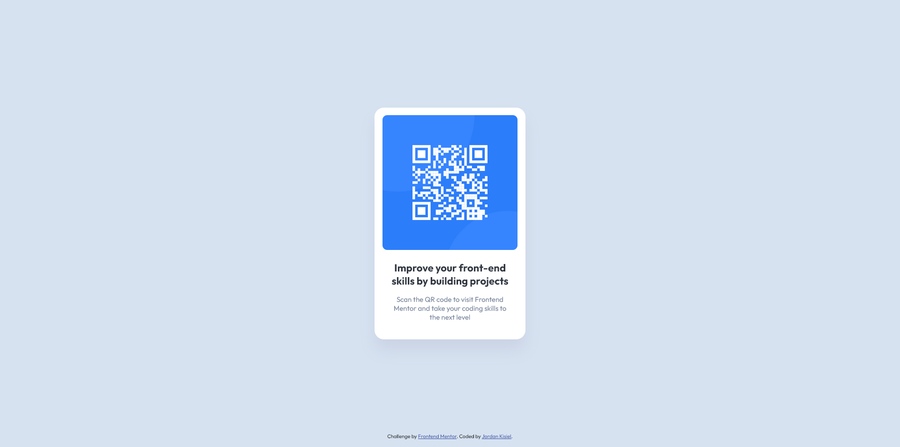

# Frontend Mentor - QR code component solution

This is a solution to the [QR code component challenge on Frontend Mentor](https://www.frontendmentor.io/challenges/qr-code-component-iux_sIO_H). Frontend Mentor challenges help you improve your coding skills by building realistic projects. 

## Table of contents

- [Overview](#overview)
  - [Screenshot](#screenshot)
  - [Links](#links)
- [My process](#my-process)
  - [Built with](#built-with)
  - [What I learned](#what-i-learned)
- [Author](#author)
- [Acknowledgments](#acknowledgments)

**Note: Delete this note and update the table of contents based on what sections you keep.**

## Overview

### Screenshot

### Links

- Solution URL: (https://jordankisiel.github.io/qr-code-component-main/)

## My process

1. Started with the html, mostly considering how many containers for the content I would need to add, in the end I figured I only needed one in order to position and size everything.
2. Then I moved on to the CSS. First I reset the margins and padding to remove any browser defaults and then I changed to display to border-box to ensure that any border would be calculated in the width (although that wasn't actually needed in this case).
3. I continued on with my CSS by using flexbox to get the main content div into the center of the viewport and then styled the rest of the elements mostly in the order that they appear in the html. I used pixel values for everything because the mobile design reference indicated that there would be no change in sizes.
4. Finally I made slight adjustments to get my final styling as close to the reference screenshots as possible and made sure that design worked on mobile as well.
5. I reviewed my code and thought about utilizing CSS variables but there wasn't much, if any, reuse of colors or any other property values.

### Built with

- Semantic HTML5 markup
- Flexbox

### What I learned

Most of this project was review of information that I had learned recently but I was reminded, in particular, that 100vh is equal to the full height of the viewport, overflow: hidden will hide scroll bars if set on the body, and about how to use flexbox.

## Author

- Website - [Jordan Kisiel](https://www.robojojo.co)
- Frontend Mentor - [@JordanKisiel](https://www.frontendmentor.io/profile/JordanKisiel)
- Twitter - [@JordanKisiel](https://www.twitter.com/JordanKisiel)

